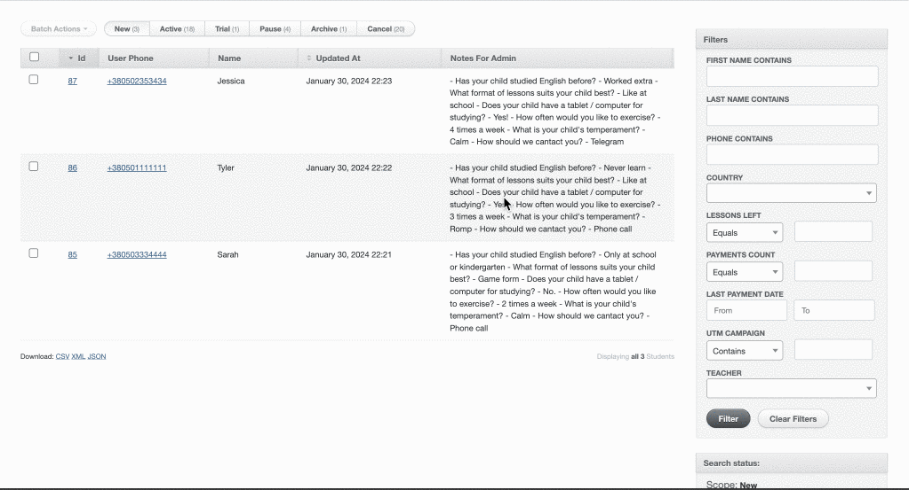

# ActiveadminDynamicTable

This is an [ActiveAdmin](https://github.com/activeadmin/activeadmin) extension that allows managing index table columns from the activeadmin UI.

## Goals
- Show/hide table columns from UI
- Resize columns
- Reorder columns



## Installation

Add this line to your application's Gemfile:

```ruby
gem 'activeadmin_dynamic_table'
```

And then execute:

    $ bundle install

Or install it yourself as:

    $ gem install activeadmin_dynamic_table

Add at the end of your ActiveAdmin styles (app/assets/stylesheets/active_admin.scss):

```scss
@import 'activeadmin_dynamic_table/all';
```

Add at the end of your ActiveAdmin javascripts (app/assets/javascripts/active_admin.js):

```
//= require activeadmin_dynamic_table/config
```

## Usage

For `index` block specify `dynamic_table` to be used instead of default `table`

```ruby
index as: :dynamic_table do
  # ...
end
```

Inside configuration block register columns that will be configurable through UI

### register_column

Method follows standard `column` dsl but also requires to provide at least `key` among options. This is key of the column in the provided URL params to detect whether or not column should be rendered.

`default: true` - specify column should be rendered by default (when columns are not specified in url params)
`width: 100` - default width of the column if it's not specified in the url params

### register_id_column

Method follows standard `id_column` dsl but also requires to provide at least `key` among options.
All other options are the same as for `register_column`

### register_actions

Method follows standard `column` dsl but also requires to provide at least `key` among options.
All other options are the same as for `register_column`

Example:

```ruby
index as: :dynamic_table do
  selectable_column

  register_id_column 'Student ID', key: :id, default: true, width: 30

  register_column :name, key: :name, default: true, width: 200, &:full_name
  register_column :user_phone, key: :phone, default: true, width: 200, &proc { |st| link_to st.phone, user_path(st.user) }

  register_column :teacher, key: :teacher, default: true, width: 200
  register_column :country, key: :country, width: 150
  register_column :updated_at, key: :updated_at, width: 100

  register_column 'LPD', key: :lpd, &proc { |st| st.last_payment_date&.strftime('%d.%m.%y %H:%M') }

  register_column 'SC', key: :sc, width: 200, default: true do |student|
    student.schedule_slots.map do |slot|
      "#{slot.day_of_week.capitalize}: #{slot.time_slot.utc.strftime('%H:%M')}"
    end.join(', ')
  end

  register_actions 'Actions', key: :actions, default: true, width: 130
end
```

## Contributing

Bug reports and pull requests are welcome on GitHub at https://github.com/amdj15/activeadmin_dynamic_table.

## License

The gem is available as open source under the terms of the [MIT License](https://opensource.org/licenses/MIT).
